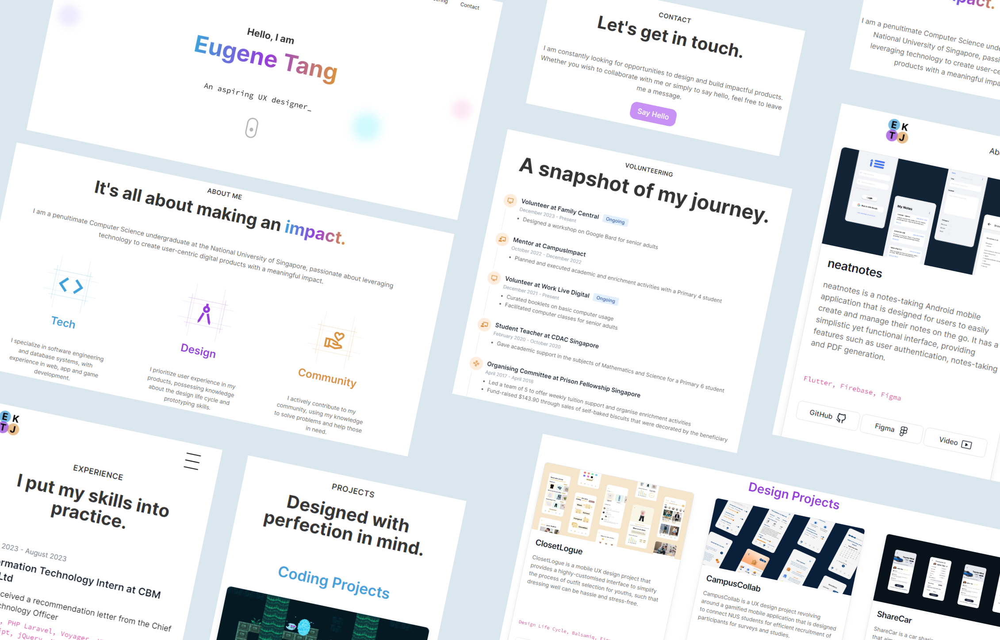

## Personal Portfolio 2024

This is my personal portfolio for the year 2024, created using Next.JS, Framer Motion and Flowbite. Similar to my previous portfolio, I went for a simple and aesthetic look. 😍

### Improvements from Previous Portfolio
I have made several improvements for this portfolio as compared to my portfolio in 2023.

**1. Tech Stack and Extensibility of Code**

My portfolio in 2023 used pure Tailwind CSS, and I hard-coded the components. This is non-ideal, because if I had to make a change to the styling for one of the components, I would have to copy and paste the changes to all the other affected components.

Thus, by using a React-based framework for this new portfolio, I have made my code more extensible. Instead of hard-coding and duplicating the same components, I abstracted out the data into a `index.js` file. Then, I created a component, and mapped my data to create multiple instances of the component. Also, I abstracted out repeated stylings into the `globals.css` file. Thus, when changes are required, I would only need to make changes to a single location instead of having to duplicate them. To add new items, I just need to insert data into the `index.js` file. Much simpler now!

**2. Animations**

This was the first time I explored Framer Motion, and I used it to create simple fade-in/fade out and movement animations to my components. There's still a long way to go, but it is a great start to creating animated websites! 😙

**3. Flowbite**

Previously, I had always created my own components. However, I took this opportunity to explore Flowbite, a component system built on Tailwind CSS which offers customisable UI components. This made development much faster, and I could easily integrate elements such as timelines and cards into my website. 👍